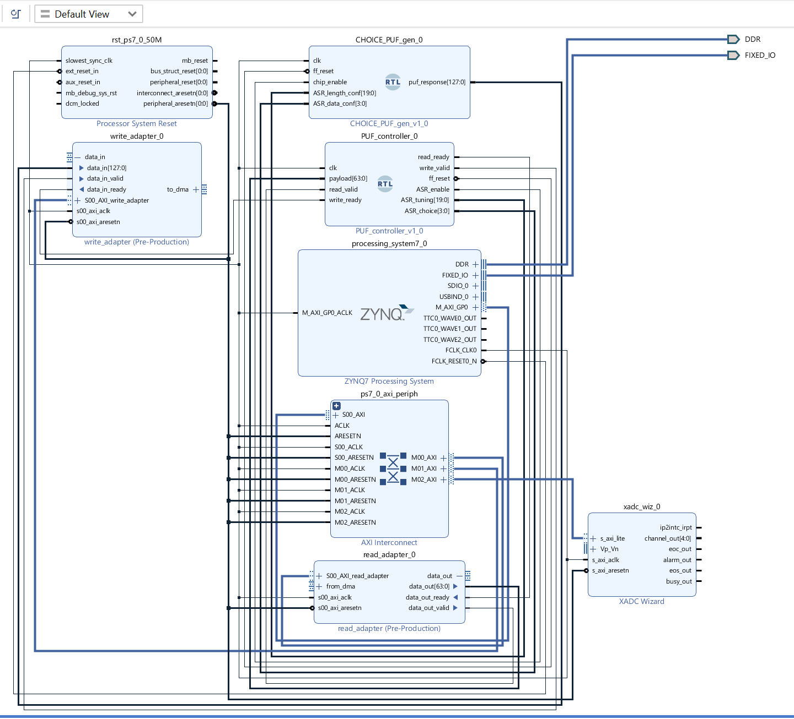
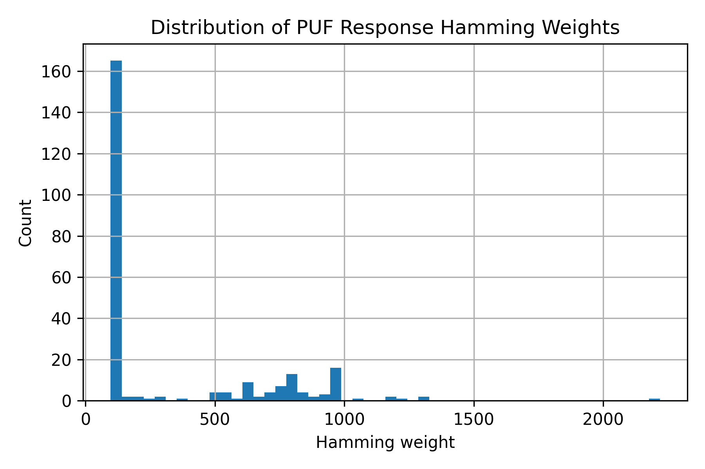
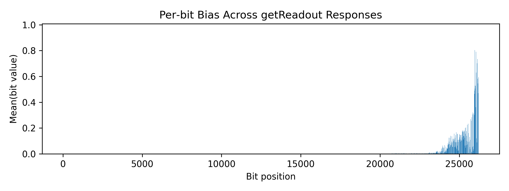
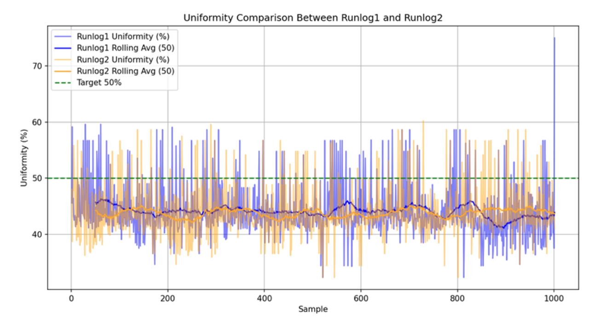
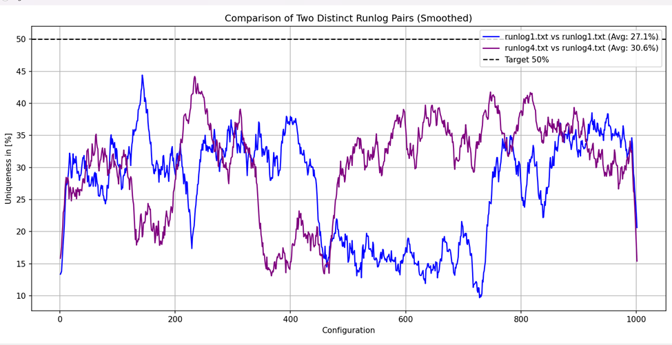

# CHOICE PUF on PYNQ-Z2

FPGA implementation and evaluation of a configurable CHOICE Physical Unclonable Function (PUF) on the Digilent PYNQ-Z2 / Xilinx Zynq-7020 platform.

This project ports a CHOICE PUF hardware-security primitive to a PYNQ-Z2 board, integrates it into a Vivado block design, exposes software-controlled challenge/tuning paths, and collects response data for uniformity, bit-bias, Hamming-weight, and reproducibility analysis. It is intended to demonstrate practical FPGA design skills across RTL, Vivado integration, board bring-up, Python-based data collection, and hardware-security evaluation.



## Highlights

- Implemented the CHOICE PUF datapath in VHDL using Xilinx primitives, including `SRLC32E` addressable shift registers and a `CARRY4`-based glitch/carry structure.
- Built a parameterized PUF array generator with a default 32-bit response width.
- Designed a hardware controller that decodes processor commands for PUF request, tune selection, choice selection, and top/bottom pattern loading.
- Integrated the RTL into a Vivado/PYNQ-Z2 design targeting the Zynq-7020 device (`7z020clg400-1`).
- Generated deployment artifacts for PYNQ workflows: `.bit`, `.hwh`, XSA/sysdef exports, custom adapter IP, and board files.
- Automated serial data collection and analysis in Python, including response extraction, bit-level CSV export, uniformity summaries, and plots.
- Collected two 1,000-sample response datasets and multi-run logs for same-board and cross-board comparison.

## Results

The repository includes measured data and plots from FPGA runs rather than only simulation output.

| Metric / Artifact | Result |
| --- | --- |
| Target FPGA | PYNQ-Z2 / Zynq-7020 (`7z020clg400-1`) |
| Vivado implementation | Synthesized, placed, routed, and bitstream generated |
| Response datasets | 2,000 collected samples across `puf_data.csv` and `puf_data_1001_2000.csv` |
| Uniformity screening | 76 retained sample/configuration indices in `consistent_uniformity_summary.csv` |
| Representative uniformity runs | 42.79%, 42.68%, and 42.70% across three run logs |
| Best retained examples | Several sampled configurations near the 50% ideal, including 50.00%, 49.04%, 50.62%, 51.67%, and 51.88% entries |
| Plots generated | Hamming weights, bit bias, same-board uniformity, and different-board uniformity |

Implementation utilization from the placed Vivado report:

| Resource | Used | Available | Utilization |
| --- | ---: | ---: | ---: |
| Slice LUTs | 1,372 | 53,200 | 2.58% |
| LUT as Logic | 798 | 53,200 | 1.50% |
| LUT as Shift Register | 574 | 17,400 | 3.30% |
| Slice Registers | 1,514 | 106,400 | 1.42% |
| Slices | 668 | 13,300 | 5.02% |

Result plots:






## System Architecture

The design is split into a small set of hardware blocks:

- `CHOICE_PUF.vhd`: single PUF cell built from addressable shift registers and carry-chain behavior.
- `CHOICE_PUF_gen.vhd`: parameterized generator that instantiates multiple PUF cells into a response bus.
- `PUF_controller.vhd`: command decoder and control path for read requests, tuning, choice selection, and pattern operations.
- `pattern_ctrl_unit.vhd`, `tune_ctrl_unit.vhd`, `request_ctrl_unit.vhd`: focused controller submodules for sequencing and configuration.
- `read_adapter` and `write_adapter`: custom IP wrappers used to connect the PUF datapath to the processing-system side of the design.

## Repository Layout

```text
.
|-- hw_src/
|   |-- hdl/                 # PUF RTL and controller VHDL
|   |-- constraints/         # PYNQ-Z2 and PUF placement constraints
|   |-- ip_repo/             # Custom read/write adapter IP
|   `-- bd/create_bd.tcl     # Block-design creation script
|-- CHOICE_design/           # Vivado project, runs, reports, and generated design files
|-- BIT_and_HWH_Files/       # PYNQ/Vivado export artifacts
|-- python_scripts/          # Serial collection, automation, and analysis scripts
|-- Collected_data/          # Captured PUF responses and run logs
|-- plots/                   # Generated evaluation plots
|-- Report/                  # Project report PDF
|-- design_1_wrapper.bit     # Generated bitstream
|-- design_1.hwh             # Hardware handoff metadata
`-- README.md
```

## Hardware / Software Stack

- Board: Digilent PYNQ-Z2
- FPGA: Xilinx Zynq-7020
- HDL: VHDL with Xilinx `UNISIM` primitives
- FPGA tools: Xilinx Vivado 2020.1 project artifacts included
- Host scripts: Python 3, serial communication, CSV processing, plotting
- Analysis outputs: uniformity summaries, Hamming-weight plots, bit-bias plots, same-board and cross-board comparison plots

## How To Use

### 1. Open or rebuild the Vivado design

Open the included Vivado project:

```text
CHOICE_design/CHOICE_design.xpr
```

The source RTL is also separated under `hw_src/hdl`, with constraints under `hw_src/constraints`. A block-design script is available at `hw_src/bd/create_bd.tcl` for recreating the design structure.

### 2. Generate or load the bitstream

The repository includes generated PYNQ artifacts:

```text
design_1_wrapper.bit
design_1.hwh
BIT_and_HWH_Files/design_1_wrapper.bit
BIT_and_HWH_Files/design_1_wrapper.hwh
```

These files can be copied to the PYNQ board and loaded using the standard PYNQ overlay flow.

### 3. Collect PUF responses

The Python scripts under `python_scripts/python_scripts_for_plots` automate serial communication and response capture. Example scripts include:

```text
SerialComm.py
SerialComm_with_bits.py
SerialComm_autorun.py
SerialComm_runlog_all_config_in_file.py
```

The scripts issue commands such as:

```text
setChoice 3 2
setTune 0x1 0x1
setPattern -t 0x0 0x0
setPattern -b 0x0 0x0
getReadout -tune -temp -ch 1000
```

### 4. Analyze results

Analysis scripts and outputs are included in `python_scripts/` and `plots/`. The collected CSV files store each command response, hex response, bit string, Hamming weight, and expanded bit columns for downstream analysis.

## Skills Demonstrated

- FPGA RTL design in VHDL
- Use of Xilinx FPGA primitives for PUF construction
- Vivado block-design integration and constraint management
- Zynq/PYNQ hardware-software co-design
- Custom IP packaging and hardware handoff generation
- Serial protocol automation for board-level testing
- Python data processing for hardware-security metrics
- Empirical evaluation of PUF response behavior

## Credits

This work is a PYNQ-Z2 implementation/evaluation of the CHOICE PUF concept, adapted from the original CHOICE PUF reference work: <https://github.com/FAU-LS12-RC/CHOICE-PUF>.

Implemented and evaluated by Prem Pochiraju.
